# VPN IPSec IKEv1 Site-to-Site Policy-Based

---

## Información del proyecto

**Autor:** Michael David Robles Fermín  

**Matrícula:** 2025-0845  

**Asignatura:** Seguridad de Redes  

**Repositorio:** https://github.com/iClexi/VPN-IKEv1-Policy-Based  

**Video demostrativo:**  
https://youtu.be/XTnlDhsIsxg?si=LeEmKwnAk4cS_gmM  

**Documentación técnica profesional:** 
Se encuentra en docs/Documentacion Tecnica Profesional.pdf

-------------

[Ver documentación técnica profesional](docs/Documentacion%20Tecnica%20Profesional.pdf)

---

## Vista general de la topología

La práctica fue desarrollada en GNS3 con una topología de VPN Site-to-Site. El diseño conecta dos redes LAN por medio de dos routers peers y un router ISP intermedio.

```text
PC-A --- SW1 --- R1 --- ISP --- R2 --- SW2 --- PC-B
```

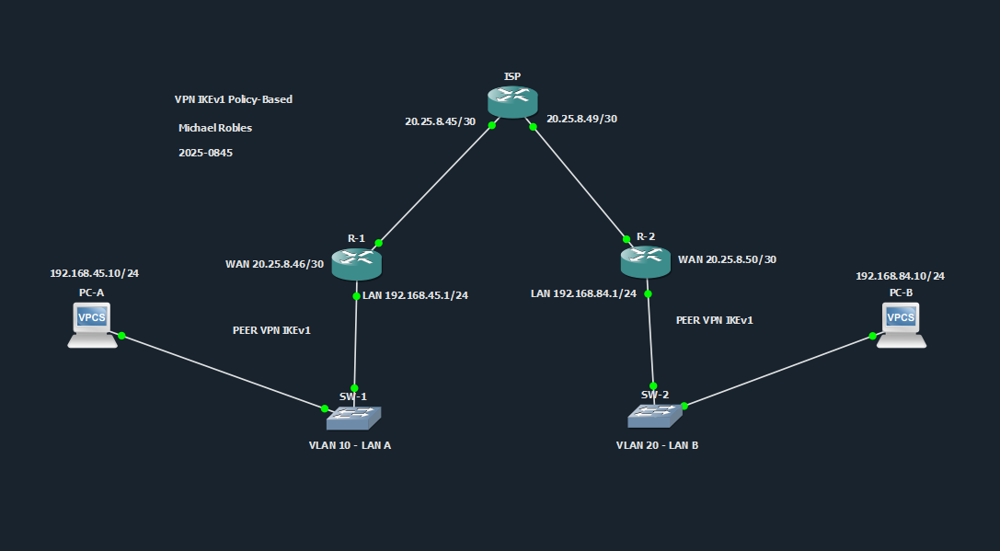

En esta topología, **R1** y **R2** son los routers que forman la VPN. El router **ISP** solamente proporciona conectividad entre ambos peers, simulando una red pública o proveedor de servicios. El ISP no cifra tráfico ni participa en la negociación de la VPN.

---

## Descripción general

Este repositorio contiene los scripts, evidencias, documentación y video demostrativo de una **VPN IPSec IKEv1 Site-to-Site basada en políticas**.

El objetivo principal es permitir que dos redes LAN diferentes puedan comunicarse de forma segura por medio de IPSec. En este caso, la LAN A se encuentra detrás de R1 y la LAN B se encuentra detrás de R2.

La comunicación protegida ocurre entre:

```text
LAN A: 192.168.45.0/24
LAN B: 192.168.84.0/24
```

---

## Objetivo del laboratorio

El objetivo de este laboratorio es configurar y demostrar el funcionamiento de una VPN IPSec IKEv1 Site-to-Site basada en políticas.

Para cumplir esto se implementó:

- Una topología con dos routers peers.
- Un router ISP como red intermedia.
- Una LAN en cada extremo.
- Configuración IPSec con IKEv1.
- ACL de tráfico interesante.
- Crypto map aplicado en la interfaz WAN.
- Pruebas de conectividad entre PC-A y PC-B.
- Verificación de IKEv1 e IPSec mediante comandos show.

---

## Conceptos utilizados

### VPN

Una VPN, o red privada virtual, permite crear una comunicación segura sobre una red que no necesariamente es segura, como Internet. Su función principal es proteger el tráfico mediante cifrado, autenticación e integridad.

### VPN Site-to-Site

Una VPN Site-to-Site conecta dos redes completas entre sí. En este laboratorio no se conecta un cliente individual, sino dos LANs completas:

- La LAN A detrás de R1.
- La LAN B detrás de R2.

Esto simula el caso de dos sucursales que necesitan comunicarse de forma segura.

### IPSec

IPSec es el conjunto de protocolos encargado de proteger el tráfico IP. En este laboratorio, IPSec cifra el tráfico que viaja entre PC-A y PC-B.

IPSec permite:

- Cifrado del tráfico.
- Verificación de integridad.
- Autenticación de los peers.
- Protección de la comunicación entre redes.

### IKEv1

IKEv1 es el protocolo encargado de negociar los parámetros de seguridad antes de que IPSec proteja el tráfico real.

En este laboratorio, R1 y R2 negocian:

- Cifrado AES 256.
- Hash SHA.
- Autenticación por clave precompartida.
- Grupo Diffie-Hellman 14.
- Tiempo de vida de la negociación.

Cuando la VPN está correctamente levantada, el estado aparece como:

```text
QM_IDLE ACTIVE
```

### VPN basada en políticas

Esta VPN es basada en políticas porque el tráfico que será cifrado se define mediante una ACL.

En R1, el tráfico interesante es:

```text
192.168.45.0/24 hacia 192.168.84.0/24
```

En R2, el tráfico interesante es:

```text
192.168.84.0/24 hacia 192.168.45.0/24
```

Si el tráfico coincide con esa política, se cifra por IPSec. Si no coincide, no entra al túnel VPN.

---

## Direccionamiento IP

| Dispositivo | Interfaz | Dirección IP | Función |
|---|---|---|---|
| PC-A | e0 | 192.168.45.10/24 | Host de la LAN A |
| R1 | Gi0/1 | 192.168.45.1/24 | Gateway de la LAN A |
| R1 | Gi0/0 | 20.25.8.46/30 | WAN / Peer VPN |
| ISP | Gi0/0 | 20.25.8.45/30 | Enlace hacia R1 |
| ISP | Gi0/1 | 20.25.8.49/30 | Enlace hacia R2 |
| R2 | Gi0/0 | 20.25.8.50/30 | WAN / Peer VPN |
| R2 | Gi0/1 | 192.168.84.1/24 | Gateway de la LAN B |
| PC-B | e0 | 192.168.84.10/24 | Host de la LAN B |

---

## VLANs utilizadas

Aunque la VPN se configura en los routers, los switches organizan cada red local mediante VLANs.

| Switch | VLAN | Nombre | Uso |
|---|---:|---|---|
| SW1 | 10 | LAN_A | Segmento de PC-A y R1 |
| SW2 | 20 | LAN_B | Segmento de PC-B y R2 |

La función de estas VLANs es mantener cada LAN organizada en su propio segmento de capa 2.

---

## Parámetros de la VPN

| Parámetro | Valor |
|---|---|
| Tipo de VPN | IPSec Site-to-Site |
| Versión IKE | IKEv1 |
| Diseño | Policy-Based |
| Autenticación | Pre-Shared Key |
| Clave precompartida | ITLA20250845 |
| Cifrado IKE | AES 256 |
| Hash | SHA |
| Diffie-Hellman | Grupo 14 |
| Lifetime | 86400 segundos |
| Transform Set | TS-IKEV1 |
| Protección IPSec | ESP-AES 256 + ESP-SHA-HMAC |
| Modo IPSec | Tunnel |
| Crypto Map | MAP-IKEV1 |
| ACL de tráfico interesante | 110 |

---

## Estructura del repositorio

```text
VPN-IKEv1-Policy-Based/
├── docs/
│   └── Documentacion Tecnica Profesional.pdf
├── images/
│   ├── 01_Topologia_GNS3.png
│   ├── 02_R1_show_ip_interface_brief.png
│   ├── 03_R2_show_ip_interface_brief.png
│   ├── 04_ISP_show_ip_interface_brief.png
│   ├── 05_SW2_show_vlan_brief.png
│   ├── 06_SW1_show_vlan_brief.png
│   ├── 07_R1_running_config_crypto.png
│   ├── 08_R2_running_config_crypto.png
│   ├── 09_R1_show_crypto_isakmp_sa.png
│   ├── 10_R2_show_crypto_isakmp_sa.png
│   ├── 11_R1_show_crypto_ipsec_sa.png
│   ├── 12_R2_show_crypto_ipsec_sa.png
│   ├── 13_VPN_levantada_R1.png
│   ├── 14_VPN_levantada_R2.png
│   ├── 15_R2_show_access_lists.png
│   ├── 16_R1_show_access_lists.png
│   ├── 17_PCA_ping_PCB.png
│   └── 18_PCB_ping_PCA.png
├── scripts/
│   ├── ISP.cfg
│   ├── PC-A.cfg
│   ├── PC-B.cfg
│   ├── R1-IKEv1-Policy-Based.cfg
│   ├── R2-IKEv1-Policy-Based.cfg
│   ├── SW1.cfg
│   ├── SW2.cfg
│   └── Verification-Commands.txt
├── video/
│   └── Video-Link.txt
└── README.md
```

---

## Explicación de los scripts

### R1-IKEv1-Policy-Based.cfg

El script de R1 configura el router del lado izquierdo como peer VPN.

En R1 se configura:

- La interfaz WAN hacia el ISP con la IP `20.25.8.46/30`.
- La interfaz LAN con la IP `192.168.45.1/24`.
- Una ruta por defecto hacia el ISP.
- La política IKEv1.
- La clave precompartida hacia R2.
- El transform-set IPSec.
- La ACL 110 para definir el tráfico interesante.
- El crypto map aplicado en la interfaz WAN.

R1 protege el tráfico desde la LAN A hacia la LAN B.

### R2-IKEv1-Policy-Based.cfg

El script de R2 configura el router del lado derecho como segundo peer VPN.

En R2 se configura:

- La interfaz WAN hacia el ISP con la IP `20.25.8.50/30`.
- La interfaz LAN con la IP `192.168.84.1/24`.
- Una ruta por defecto hacia el ISP.
- La misma política IKEv1 usada por R1.
- La clave precompartida hacia R1.
- El transform-set IPSec.
- La ACL 110 en sentido contrario.
- El crypto map aplicado en la interfaz WAN.

R2 protege el tráfico desde la LAN B hacia la LAN A.

### ISP.cfg

El router ISP solamente conecta a R1 con R2.

El ISP no contiene configuración de VPN, no usa crypto map, no usa ISAKMP y no cifra tráfico. Su función es simular la red intermedia.

### SW1.cfg y SW2.cfg

SW1 contiene la VLAN 10 para la LAN A.  
SW2 contiene la VLAN 20 para la LAN B.

Ambos switches trabajan como switches de acceso.

### PC-A.cfg y PC-B.cfg

PC-A se configura con:

```text
IP: 192.168.45.10/24
Gateway: 192.168.45.1
```

PC-B se configura con:

```text
IP: 192.168.84.10/24
Gateway: 192.168.84.1
```

Estas PCs se utilizan para validar la comunicación entre ambas LANs.

---

## Funcionamiento técnico

El funcionamiento general de la VPN es el siguiente:

1. PC-A intenta comunicarse con PC-B.
2. El tráfico llega a R1.
3. R1 revisa si el tráfico coincide con la ACL 110.
4. Como el tráfico va desde la LAN A hacia la LAN B, coincide con la política.
5. El crypto map activa la negociación IKEv1 con R2.
6. R1 y R2 negocian los parámetros de seguridad.
7. IPSec cifra el tráfico.
8. El tráfico viaja cifrado a través del ISP.
9. R2 recibe el tráfico, lo descifra y lo entrega a PC-B.
10. La respuesta de PC-B vuelve protegida en sentido contrario.

---

## Evidencias

### Topología general


La topología muestra los dos peers VPN, el router ISP y una LAN en cada extremo.

### Interfaces de R1

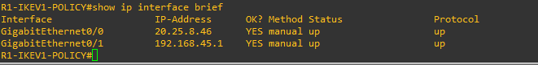

Se confirma que R1 tiene activas la interfaz WAN `20.25.8.46/30` y la interfaz LAN `192.168.45.1/24`.

### Interfaces de R2

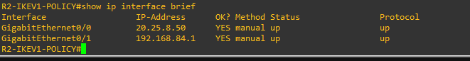

Se confirma que R2 tiene activas la interfaz WAN `20.25.8.50/30` y la interfaz LAN `192.168.84.1/24`.

### Interfaces del ISP

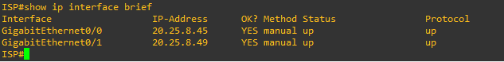

Se confirma que el ISP tiene conectividad hacia R1 y hacia R2.

### VLAN en SW2

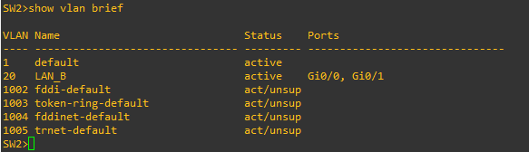

Se observa la VLAN 20, utilizada para la LAN B.

### VLAN en SW1

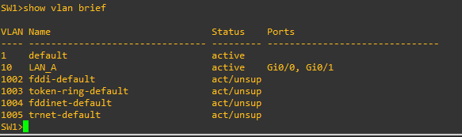

Se observa la VLAN 10, utilizada para la LAN A.

### Configuración crypto en R1

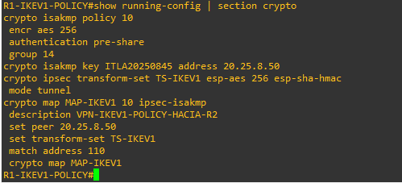

Se observa la política IKEv1, la clave precompartida, el transform-set y el crypto map de R1.

### Configuración crypto en R2

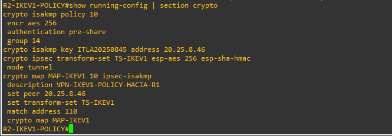

Se observa la configuración equivalente de R2, apuntando hacia R1 como peer remoto.

### Estado IKEv1 en R1

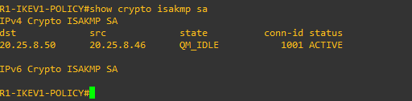

El estado `QM_IDLE ACTIVE` confirma que la negociación IKEv1 se completó correctamente.

### Estado IKEv1 en R2

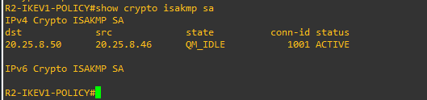

R2 también muestra `QM_IDLE ACTIVE`, confirmando que ambos peers tienen la VPN levantada.

### IPSec en R1

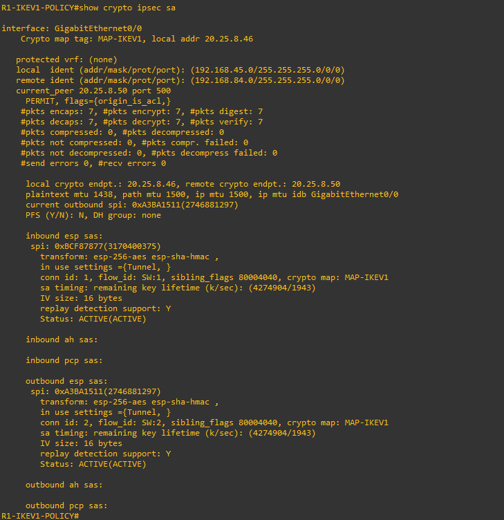

Los contadores de IPSec muestran paquetes encapsulados, cifrados, desencapsulados y descifrados.

### IPSec en R2

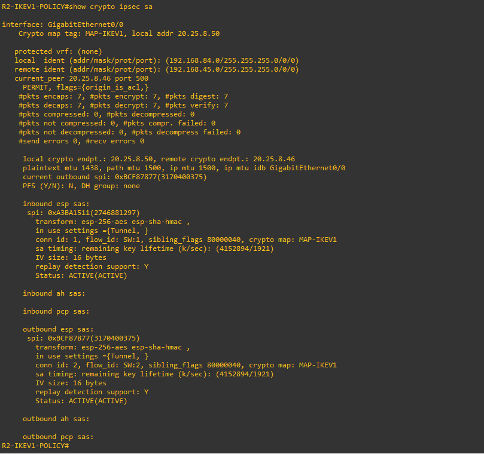

R2 también muestra tráfico protegido por IPSec.

### Verificación adicional en R1


Evidencia adicional del estado operativo de la VPN en R1.

### Verificación adicional en R2


Evidencia adicional del estado operativo de la VPN en R2.

### ACL en R2


La ACL 110 en R2 define el tráfico interesante desde la LAN B hacia la LAN A.

### ACL en R1

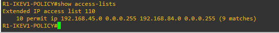

La ACL 110 en R1 define el tráfico interesante desde la LAN A hacia la LAN B.

### Ping desde PC-A hacia PC-B

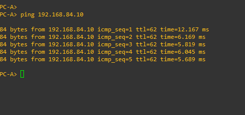

Esta prueba demuestra conectividad desde la LAN A hacia la LAN B.

### Ping desde PC-B hacia PC-A

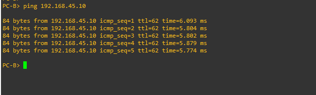

Esta prueba confirma la conectividad en sentido contrario.

---

## Comandos de verificación

En routers:

```cisco
show clock
show ip interface brief
show running-config | section crypto
show crypto isakmp sa
show crypto ipsec sa
show access-lists
```

En PCs:

```bash
show ip
ping 192.168.84.10
ping 192.168.45.10
```

---

## Resultado esperado

La VPN debe aparecer activa mediante el comando:

```cisco
show crypto isakmp sa
```

Resultado esperado:

```text
QM_IDLE ACTIVE
```

También deben observarse contadores mayores que cero en:

```cisco
show crypto ipsec sa
```

Contadores importantes:

```text
#pkts encaps
#pkts encrypt
#pkts decaps
#pkts decrypt
```

Esto confirma que la VPN no solo está configurada, sino que está cifrando y descifrando tráfico real entre ambas LANs.

---

## Documentación técnica profesional

La documentación completa está disponible en el siguiente enlace interno del repositorio:

[Ver documentación técnica profesional](docs/Documentacion%20Tecnica%20Profesional.pdf)

---

## Conclusión

La VPN IPSec IKEv1 Site-to-Site basada en políticas fue configurada correctamente. R1 y R2 funcionaron como peers VPN, el ISP actuó como red intermedia y las redes `192.168.45.0/24` y `192.168.84.0/24` lograron comunicarse de forma segura.

Las evidencias muestran que IKEv1 alcanzó el estado `QM_IDLE ACTIVE` y que IPSec registró tráfico cifrado y descifrado. Esto confirma que la comunicación entre PC-A y PC-B fue protegida correctamente mediante IPSec.
