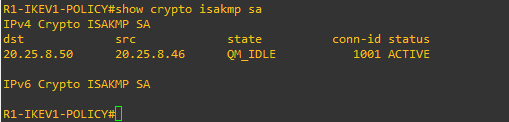
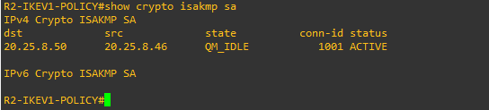

VPN IPSec IKEv1 Site-to-Site Policy-Based
Autor: Michael David Robles Fermín  
Matrícula: 2025-0845  
Asignatura: Seguridad de Redes  
Repositorio: https://github.com/iClexi/VPN-IKEv1-Policy-Based  
Video demostrativo: https://youtu.be/XTnlDhsIsxg?si=LeEmKwnAk4cS_gmM
---
1. Descripción general
Este repositorio contiene la configuración, evidencias y documentación de una VPN IPSec Site-to-Site utilizando IKEv1 y un diseño basado en políticas. El laboratorio fue desarrollado en GNS3 usando dos routers como peers VPN, un router ISP como red intermedia, dos switches de acceso y una LAN en cada extremo.
La finalidad del laboratorio es demostrar cómo dos redes LAN separadas pueden comunicarse de forma segura a través de una red intermedia, simulando un escenario real donde dos sedes de una empresa se conectan mediante una VPN.
La topología utilizada es la siguiente:
```text
PC-A --- SW1 --- R1 --- ISP --- R2 --- SW2 --- PC-B
```
En este diseño, R1 y R2 son los routers que establecen la VPN. El router ISP no participa en el cifrado; solamente permite conectividad entre las interfaces WAN de ambos routers.
---
2. Objetivo del laboratorio
El objetivo principal es configurar y demostrar una VPN IPSec IKEv1 Site-to-Site basada en políticas entre dos redes LAN.
Objetivos específicos:
Configurar una topología con dos routers peers, un router ISP y una LAN en cada extremo.
Implementar una VPN IPSec Site-to-Site usando IKEv1.
Utilizar una ACL para definir el tráfico interesante que será protegido por IPSec.
Aplicar un crypto map en la interfaz WAN de cada router peer.
Verificar la conectividad entre PC-A y PC-B.
Confirmar que IKEv1 está levantado y que IPSec está cifrando tráfico real.
---
3. Conceptos principales
3.1 ¿Qué es una VPN?
Una VPN, o red privada virtual, permite crear una comunicación segura sobre una red que no necesariamente es segura, como Internet. Su propósito es proteger el tráfico entre dos puntos mediante cifrado, autenticación e integridad.
En este laboratorio, la VPN permite que la LAN A y la LAN B se comuniquen de forma segura a través del router ISP.
3.2 ¿Qué es una VPN Site-to-Site?
Una VPN Site-to-Site conecta dos redes completas entre sí. No se trata de conectar un solo cliente remoto, sino de unir dos LANs como si estuvieran comunicadas por un enlace privado.
En este caso:
```text
LAN A: 192.168.45.0/24
LAN B: 192.168.84.0/24
```
El tráfico entre ambas redes viaja protegido por IPSec.
3.3 ¿Qué es IPSec?
IPSec es un conjunto de protocolos de seguridad utilizado para proteger tráfico IP. Permite cifrar los paquetes, verificar su integridad y autenticar los extremos de la comunicación.
En este laboratorio, IPSec se encarga de proteger el tráfico real entre PC-A y PC-B.
3.4 ¿Qué es IKEv1?
IKEv1 es el protocolo que negocia los parámetros de seguridad antes de que IPSec pueda proteger el tráfico. Los routers R1 y R2 usan IKEv1 para acordar cifrado, autenticación, grupo Diffie-Hellman y clave precompartida.
Una vez la negociación se completa, la VPN aparece en estado `QM\_IDLE ACTIVE`.
3.5 ¿Qué significa Policy-Based VPN?
Una VPN basada en políticas utiliza una ACL para definir qué tráfico será cifrado. En este laboratorio, la ACL 110 indica cuáles redes deben comunicarse por la VPN.
En R1 se protege el tráfico desde la LAN A hacia la LAN B:
```text
192.168.45.0/24 hacia 192.168.84.0/24
```
En R2 se protege el tráfico en sentido contrario:
```text
192.168.84.0/24 hacia 192.168.45.0/24
```
Si el tráfico coincide con esa ACL, entra a la VPN. Si no coincide, no se cifra.
---
4. Topología utilizada
La topología está compuesta por siete dispositivos:
PC-A: host de la LAN A.
SW1: switch de acceso de la LAN A.
R1: router peer VPN del lado izquierdo.
ISP: router intermedio que simula la red del proveedor.
R2: router peer VPN del lado derecho.
SW2: switch de acceso de la LAN B.
PC-B: host de la LAN B.

La imagen anterior muestra la topología completa en GNS3. En ella se observan los dos extremos de la VPN, las redes LAN, el router ISP y las notas de direccionamiento usadas durante el laboratorio.
---
5. Direccionamiento IP
Dispositivo	Interfaz	Dirección IP	Función
PC-A	e0	192.168.45.10/24	Host de la LAN A
R1	Gi0/1	192.168.45.1/24	Gateway de la LAN A
R1	Gi0/0	20.25.8.46/30	WAN / Peer VPN
ISP	Gi0/0	20.25.8.45/30	Enlace hacia R1
ISP	Gi0/1	20.25.8.49/30	Enlace hacia R2
R2	Gi0/0	20.25.8.50/30	WAN / Peer VPN
R2	Gi0/1	192.168.84.1/24	Gateway de la LAN B
PC-B	e0	192.168.84.10/24	Host de la LAN B
El direccionamiento utiliza la matrícula 2025-0845 como base para mantener consistencia con el laboratorio. La LAN A usa la red 192.168.45.0/24 y la LAN B usa la red 192.168.84.0/24. Para los enlaces WAN se utilizan subredes /30, ya que solo se necesitan dos direcciones útiles por enlace punto a punto.
---
6. VLANs utilizadas
Aunque la VPN se configura en los routers, los switches permiten separar y organizar cada LAN.
En SW1 se configuró la VLAN 10 para la LAN A:
```text
VLAN 10 - LAN\_A
```
En SW2 se configuró la VLAN 20 para la LAN B:
```text
VLAN 20 - LAN\_B
```
Estas VLANs permiten que los puertos conectados a las PCs y a los routers pertenezcan al segmento correcto. La VLAN no cifra el tráfico; su función aquí es organizar la red local de cada extremo.
---
7. Parámetros de la VPN
Parámetro	Valor
Tipo de VPN	IPSec Site-to-Site
Versión IKE	IKEv1
Tipo de diseño	Policy-Based
Autenticación	Pre-Shared Key
Clave	ITLA20250845
Cifrado IKE	AES 256
Hash	SHA
Diffie-Hellman	Grupo 14
Lifetime	86400 segundos
Transform Set	TS-IKEV1
Protección IPSec	ESP-AES 256 + ESP-SHA-HMAC
Modo IPSec	Tunnel
Crypto Map	MAP-IKEV1
ACL de tráfico interesante	110
---
8. Archivos del repositorio
La carpeta `scripts` contiene los archivos de configuración utilizados en cada dispositivo:
```text
scripts/
├── ISP.cfg
├── PC-A.cfg
├── PC-B.cfg
├── R1-IKEv1-Policy-Based.cfg
├── R2-IKEv1-Policy-Based.cfg
├── SW1.cfg
├── SW2.cfg
└── Verification-Commands.txt
```
La carpeta `docs` contiene la documentación técnica profesional del laboratorio:
```text
docs/
└── MichaelRobles\_2025-0845\_Documentacion-Tecnica-Profesional-VPN-IKEv1-Policy-Based\_P1.pdf
```
La carpeta `images` contiene las capturas usadas como evidencias:
```text
images/
└── Evidencias del laboratorio
```
La carpeta `video` contiene el archivo con el enlace del video demostrativo:
```text
video/
└── Video-Link.txt
```
---
9. Explicación de los scripts principales
9.1 R1-IKEv1-Policy-Based.cfg
El script de R1 configura el router del lado izquierdo como peer VPN. Primero se asignan las direcciones IP de sus interfaces:
Gi0/0 como WAN hacia el ISP con la IP 20.25.8.46/30.
Gi0/1 como LAN A con la IP 192.168.45.1/24.
También se configura una ruta por defecto hacia el ISP:
```text
0.0.0.0/0 vía 20.25.8.45
```
Luego se configura la política IKEv1, donde se define AES 256, SHA, autenticación por clave precompartida, grupo Diffie-Hellman 14 y lifetime de 86400 segundos.
Después se configura la clave precompartida hacia R2:
```text
ITLA20250845 hacia 20.25.8.50
```
También se configura el transform-set IPSec `TS-IKEV1`, que utiliza ESP-AES 256 y ESP-SHA-HMAC en modo túnel.
Finalmente, se configura la ACL 110 como tráfico interesante desde la LAN A hacia la LAN B y se aplica el crypto map en la interfaz WAN Gi0/0.
9.2 R2-IKEv1-Policy-Based.cfg
El script de R2 configura el router del lado derecho como el segundo peer VPN. Sus interfaces principales son:
Gi0/0 como WAN hacia el ISP con la IP 20.25.8.50/30.
Gi0/1 como LAN B con la IP 192.168.84.1/24.
R2 también tiene una ruta por defecto hacia el ISP:
```text
0.0.0.0/0 vía 20.25.8.49
```
La configuración VPN de R2 utiliza los mismos parámetros que R1. La diferencia principal es que el peer remoto de R2 es R1, por lo tanto apunta a la IP 20.25.8.46.
La ACL 110 en R2 está en sentido contrario, protegiendo el tráfico desde 192.168.84.0/24 hacia 192.168.45.0/24.
9.3 ISP.cfg
El router ISP no tiene configuración VPN. Su función es simular la red del proveedor y permitir que R1 y R2 tengan conectividad entre sus interfaces WAN.
Sus interfaces son:
Gi0/0 hacia R1 con la IP 20.25.8.45/30.
Gi0/1 hacia R2 con la IP 20.25.8.49/30.
El ISP no usa ISAKMP, no usa transform-set y no tiene crypto map.
9.4 SW1.cfg y SW2.cfg
SW1 funciona como switch de acceso para la LAN A. En este switch se configura la VLAN 10 llamada `LAN\_A`, y los puertos hacia R1 y PC-A se colocan como puertos de acceso en esa VLAN.
SW2 funciona como switch de acceso para la LAN B. En este switch se configura la VLAN 20 llamada `LAN\_B`, y los puertos hacia R2 y PC-B se colocan como puertos de acceso en esa VLAN.
9.5 PC-A.cfg y PC-B.cfg
PC-A se configura con la IP 192.168.45.10/24 y gateway 192.168.45.1.
PC-B se configura con la IP 192.168.84.10/24 y gateway 192.168.84.1.
Estas PCs se utilizan para probar la comunicación entre ambas LANs por medio de la VPN.
---
10. Funcionamiento técnico de la VPN
El funcionamiento de la VPN se puede resumir en los siguientes pasos:
PC-A intenta comunicarse con PC-B.
El tráfico sale desde la LAN A hacia R1.
R1 revisa si el tráfico coincide con la ACL 110.
Como el tráfico va desde 192.168.45.0/24 hacia 192.168.84.0/24, coincide con la política.
El crypto map activa la negociación IKEv1 con R2.
R1 y R2 negocian los parámetros de seguridad usando IKEv1.
Luego IPSec protege el tráfico real usando ESP.
El tráfico viaja cifrado por medio del ISP.
R2 recibe el tráfico, lo descifra y lo entrega a la LAN B.
PC-B responde usando el mismo proceso en sentido contrario.
---
11. Evidencias del laboratorio
11.1 Interfaces de R1

Esta evidencia muestra las interfaces principales de R1. La interfaz WAN tiene la IP 20.25.8.46/30 y la interfaz LAN tiene la IP 192.168.45.1/24. Ambas se encuentran activas, permitiendo comunicación hacia el ISP y hacia la LAN A.
11.2 Interfaces de R2

Esta captura muestra que R2 tiene activa su interfaz WAN con la IP 20.25.8.50/30 y su interfaz LAN con la IP 192.168.84.1/24. Esto confirma que R2 puede comunicarse con el ISP y funcionar como gateway de la LAN B.
11.3 Interfaces del ISP

El router ISP tiene dos interfaces activas: una hacia R1 con la IP 20.25.8.45/30 y otra hacia R2 con la IP 20.25.8.49/30. Esto permite conectividad entre los peers VPN.
11.4 VLAN en SW2

En SW2 se observa la VLAN 20, correspondiente a la LAN B. Los puertos conectados a R2 y PC-B pertenecen a esta VLAN.
11.5 VLAN en SW1

En SW1 se observa la VLAN 10, correspondiente a la LAN A. Esta VLAN contiene los puertos conectados a R1 y PC-A.
11.6 Configuración crypto en R1

Esta evidencia muestra la configuración crypto en R1. Se observa la política IKEv1, la clave precompartida hacia R2, el transform-set IPSec y el crypto map que utiliza la ACL 110 como tráfico interesante.
11.7 Configuración crypto en R2

En R2 se observa una configuración equivalente a la de R1, pero apuntando hacia el peer remoto 20.25.8.46, que corresponde a la WAN de R1.
11.8 Estado IKEv1 en R1

El comando `show crypto isakmp sa` muestra el estado de la negociación IKEv1. El estado `QM\_IDLE ACTIVE` confirma que la sesión IKEv1 se estableció correctamente entre R1 y R2.
11.9 Estado IKEv1 en R2

En R2 también se observa `QM\_IDLE ACTIVE`, confirmando que ambos routers reconocen la VPN como activa.
11.10 IPSec en R1

Esta evidencia muestra que IPSec está procesando tráfico. Los contadores de paquetes encapsulados, cifrados, desencapsulados y descifrados demuestran que existe tráfico real protegido por la VPN.
11.11 IPSec en R2

En R2 también se observan contadores IPSec, confirmando que el tráfico se protege correctamente en ambos sentidos.
11.12 Verificación adicional de VPN en R1

Esta captura sirve como evidencia adicional del estado de la VPN en R1.
11.13 Verificación adicional de VPN en R2

Esta captura sirve como evidencia adicional del estado de la VPN en R2.
11.14 ACL en R2

La ACL 110 en R2 define el tráfico interesante desde la LAN B hacia la LAN A. Los matches indican que el tráfico está coincidiendo con la política de cifrado.
11.15 ACL en R1

La ACL 110 en R1 define el tráfico interesante desde la LAN A hacia la LAN B. Esta ACL es uno de los elementos principales de la VPN basada en políticas.
11.16 Ping desde PC-A hacia PC-B

Esta prueba demuestra conectividad desde la LAN A hacia la LAN B. El tráfico viaja desde PC-A hacia PC-B atravesando la VPN IPSec.
11.17 Ping desde PC-B hacia PC-A

Esta prueba demuestra conectividad en sentido contrario, desde la LAN B hacia la LAN A. Con esto se confirma comunicación bidireccional entre ambas redes.
---
12. Comandos de verificación
Los comandos utilizados para validar el funcionamiento fueron:
```cisco
show clock
show ip interface brief
show running-config | section crypto
show crypto isakmp sa
show crypto ipsec sa
show access-lists
```
En las PCs se utilizaron:
```bash
show ip
ping 192.168.84.10
ping 192.168.45.10
```
---
13. Resultado esperado
El resultado esperado es que PC-A pueda comunicarse con PC-B y viceversa. Además, la VPN debe aparecer activa en los routers.
El comando:
```cisco
show crypto isakmp sa
```
Debe mostrar:
```text
QM\_IDLE ACTIVE
```
El comando:
```cisco
show crypto ipsec sa
```
Debe mostrar contadores mayores que cero en:
```text
#pkts encaps
#pkts encrypt
#pkts decaps
#pkts decrypt
```
Esto demuestra que la VPN no solo está configurada, sino que realmente está cifrando y descifrando tráfico entre ambas LANs.
---
14. Conclusión
La VPN IPSec IKEv1 Site-to-Site basada en políticas fue configurada y verificada correctamente. R1 y R2 funcionaron como peers VPN, el ISP actuó únicamente como router intermedio y las LANs 192.168.45.0/24 y 192.168.84.0/24 lograron comunicarse de forma segura.
Las evidencias muestran que IKEv1 alcanzó el estado `QM\_IDLE ACTIVE` y que IPSec registró paquetes cifrados y descifrados. Esto confirma que el tráfico entre PC-A y PC-B fue protegido correctamente mediante IPSec.
---
15. Entregables incluidos
Este repositorio contiene:
Scripts de configuración por dispositivo.
Capturas de evidencia del laboratorio.
Documentación técnica profesional.
Enlace del video demostrativo.
README explicativo del funcionamiento general.
